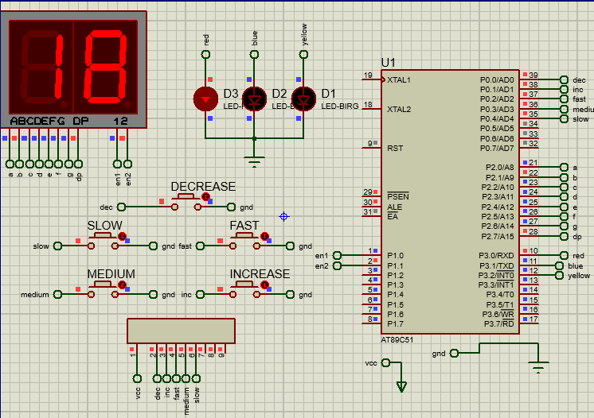

# traffic-system
traffic system using AT89C51 developed in assembly language

### Requirements

Turn ON the green light LED/Lamp for a specific time period. This period can be changed based on a predetermined number “Max” (can be 20, 30, or etc) shown on two 7-segments.
* “Max” should start to count down on the 7-segments until it reaches 00, when the green light is turned Off and the red light turns ON.
* After 00, the 7-segments will be reloaded with “Max” again and starts to count down until 00, hence, the Red light is Off, green ON, and so on.
* Users have the capability to change “Max” on the 7-segments to meet several conditions of traffic.
* Users have the capability to change the frequency of counting using switches or push buttons. The frequencies can be subjective (low, medium, and fast), but you have to demonstrate different counting frequencies. No need to use timers for delays
* 7-segments are used without decoders, and all codes are in assembly.

### running
* used silicon labs IDE to build the asm files targeting C8051F02x Device family
* open proteus and select the hex file in the Microcontroller index then run.

    

